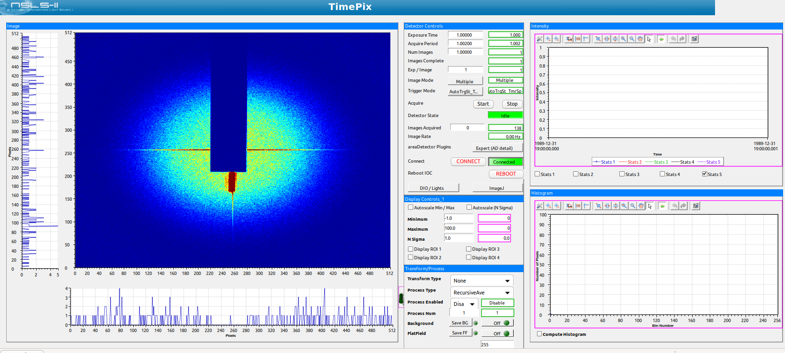
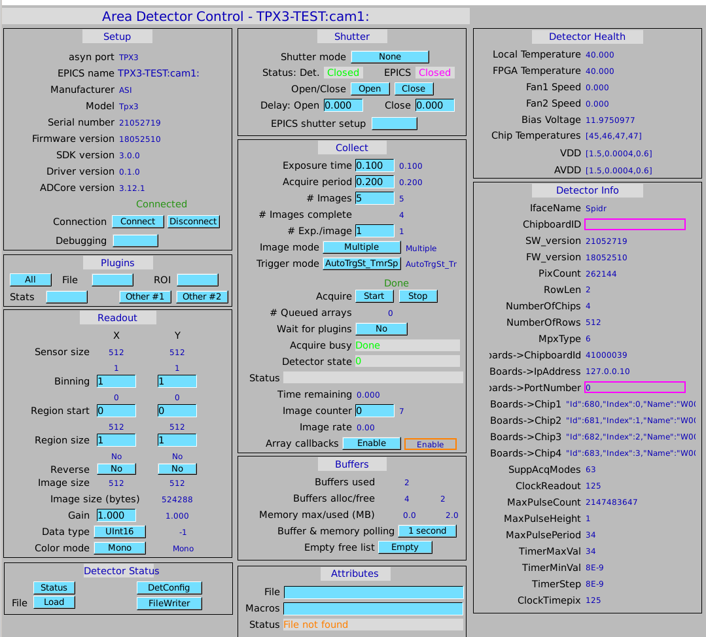
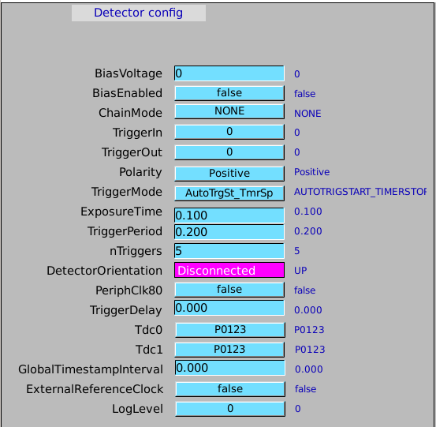
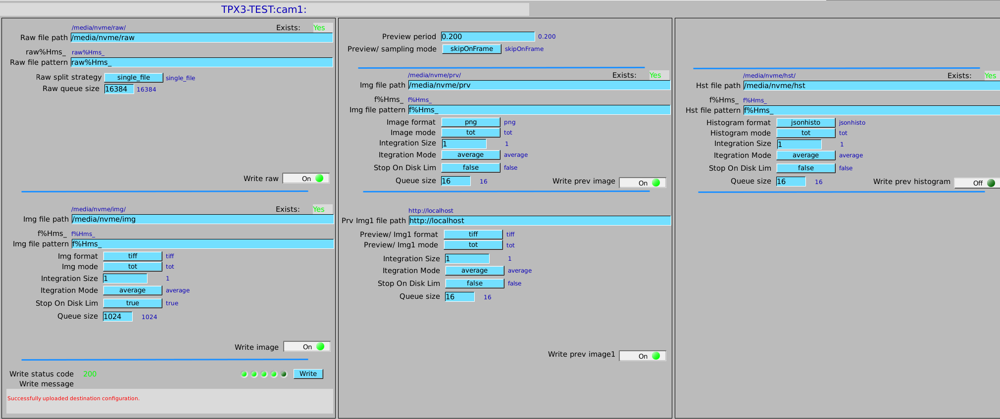
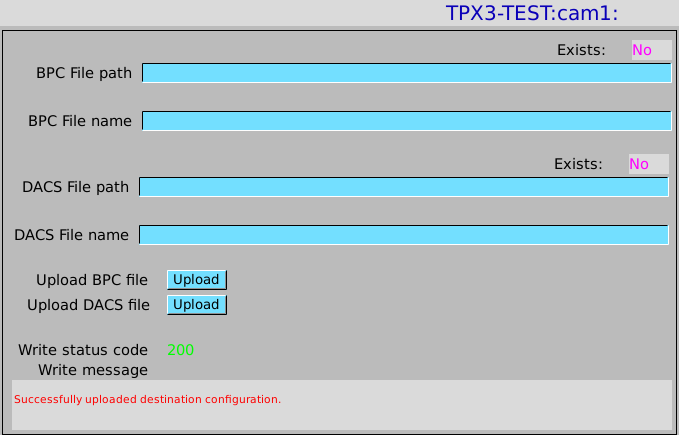
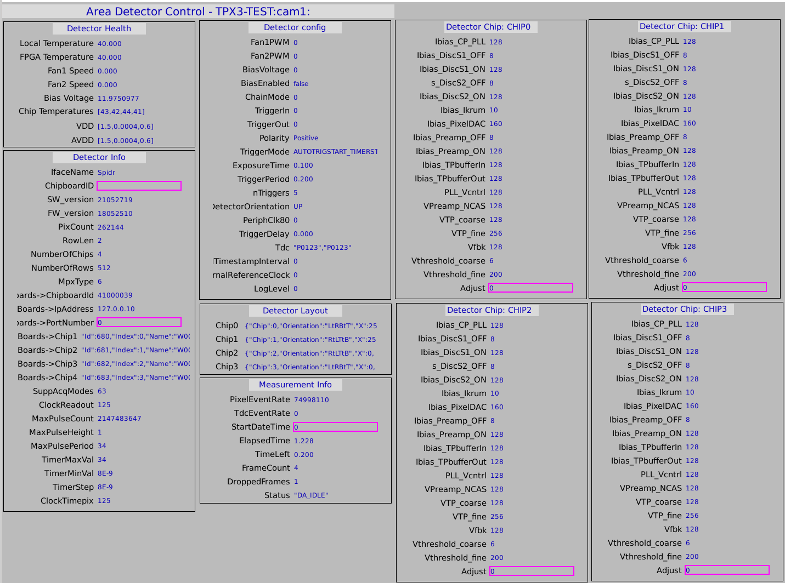
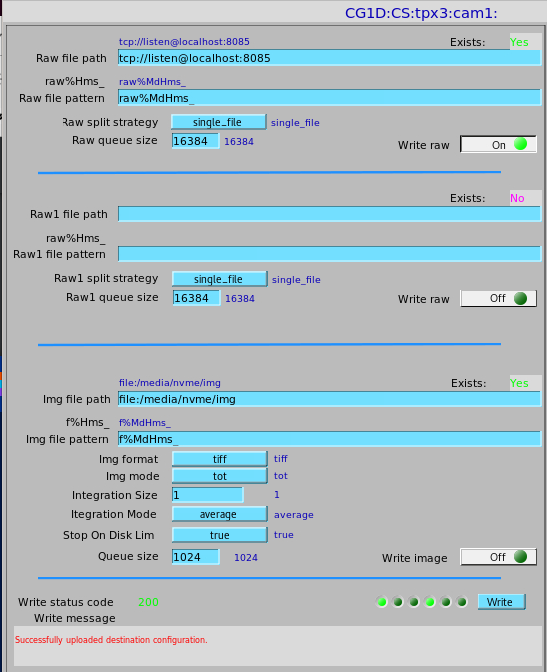
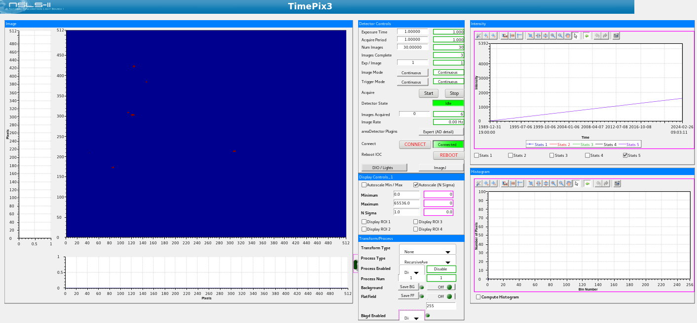

======================================
ADTimePix3
======================================

:author: Kazimierz Gofron, Oak Ridge National Laboratory

.. contents:: Contents

Notes
-----

* Latest release: **R1-6-3** (driver **1.6.3**). See `RELEASE.md` in the repository for full release notes.
* Depends on the CPR version **1.14.2** (bundled under ``tpx3Support``).
* Build baseline for bundled CPR is **C++17** (``-std=c++17`` in ``tpx3Support`` and ``tpx3App/src`` Makefiles).
* Depends on the json version v3.11.2 (bundled under ``tpx3Support``).
* Developed with ADCore R3-11 and ADSupport R1-10 or newer.
* This has only been developed/tested on ubuntu 22.04, 20.04, 18.04, RHEL 7.9, RHEL 9.6 Linux 64-bit machines.
* Layout support in driver and OPI is most complete for **1 chip** and **2x2 quad**; **8-chip** (e.g. 2x4 mosaic, two SPIDR boards) has IOC/DB/driver support -- see ``documentation/8chip-migration.md``; validate BPC/mask mapping and screens on your hardware.
* **Serval versions**: The master branch supports Serval 4.x.x and 3.x.x. Serval 4.1.5 is recommended for 4.x (dual-image fix). Serval 4.1.5-rc2 requires the matching TimePix3 Emulator version. Data replay is currently supported only with older Serval (3.3.2). Serval 2.x.y is in a separate branch and is not under active development.
* Driver is specific to Serval version, since features differ.
* The driver has been developed using the TimePix3 Emulator and real detectors (quad-chip and single-chip).

Before compiling
----------------

* CPR and nlohmann/json are vendored in ``tpx3Support``; a normal EPICS module build (``make``) compiles them with the driver. See ``README.md`` for ADCore/ADSupport dependencies.

How to run
----------

* Under ADTimePix3/iocs/tpx3IOC/iocBoot/iocTimePix there is already a ready to use IOC for the TimePix3

  #. run serval

  #. Change the IP address in st.cmd or st_base.cmd

  #. Run ./st.cmd

* Operator screens are under ``tpx3App/op/bob/`` (Phoebus) and ``tpx3App/op/opi/`` (legacy CSS-Boy). The main screen is ``tpx3App/op/bob/TimePix3.bob``.

Adjust chip thresholds
----------------------

* Optimize/equalize chips in the 'count' mode (not ToT)
* Threshold fine increase is closer to noise (you get more counts)
* Threshold fine decrease is away from noise, higher threshold in keV. (you get less counts)
* These threshold settings can depend on X-ray energy.
* After changing the thresholds take a background image to check that you do not get extra noise pixels.

CSS screens
-----------

The following is the CSS screen ADTimePix3.opi when controlling an ADTimePix3 camera.

The following are the CSS screens for features of ADTimePix3 detector 

Serval 3.3.0 allows multiple raw streams (socket, .tpx3 file writing)

Neutron clusters

    