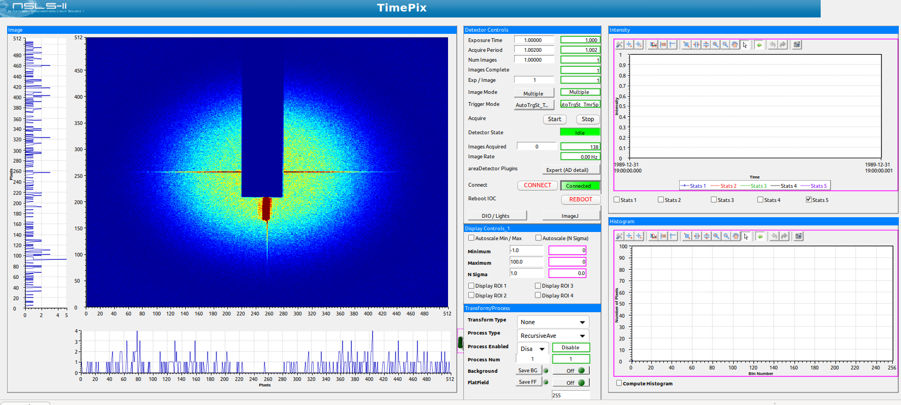

======================================
ADTimePix3
======================================

:author: Kazimierz Gofron, Brookhaven National Laboratory

.. contents:: Contents

Notes
-----

* Depends on the CPR verson 1.9.1.
* Depends on the json version v3.11.2.
* Developed with ADCore R3-11 and ADSupport R1-10 or newer.
* This has only been tested on ubuntu 18.04 and 20.04 Linux 64-bit machines.
* This has only been developed for 2 x 2 chips layout, since that is what I have access to now
* This has only been tested with serval version 3.0.0.
* Driver is specific to Serval version, since features differ.

Before compiling
----------------

* Compile cpr
* Clone json

How to run
----------

* Under ADTimePix3/iocs/tpx3IOC/iocBoot/iocTimePix there is already a ready to use IOC for the TimePix3

  #. run serval

  #. Change the IP address in st.cmd 

  #. Run ./st.cmd

* There are CSS-Boy, screens under areaDetector/tpx3App/op/ [TODO - update for serval 3.0.0].

CSS screens
-----------

The following is the CSS screen ADTimePix3.opi when controlling an ADTimePix3 camera.

The following are the CSS screens for features of ADTimePix3 detector 

.. figure:: Screenshots/TimePix3_FileWriter.png
    :align: center

