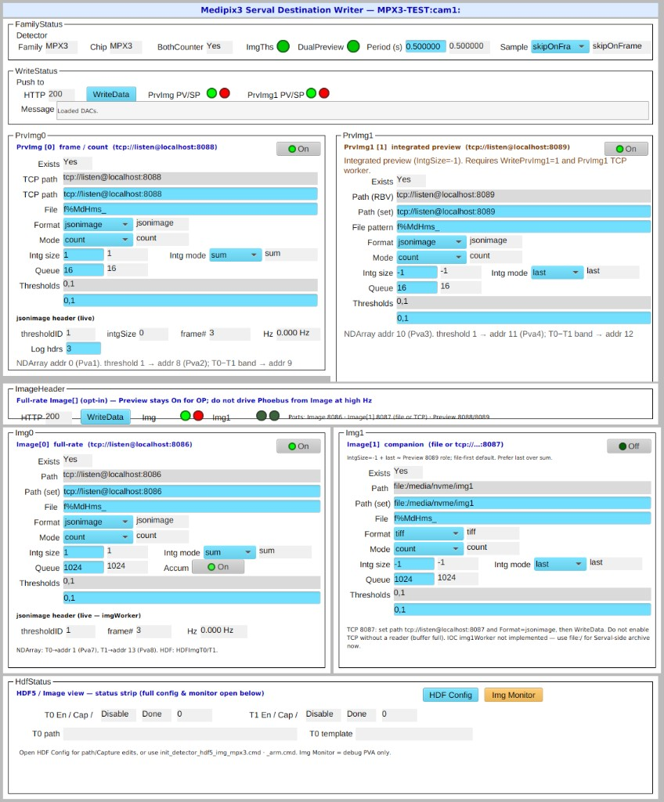
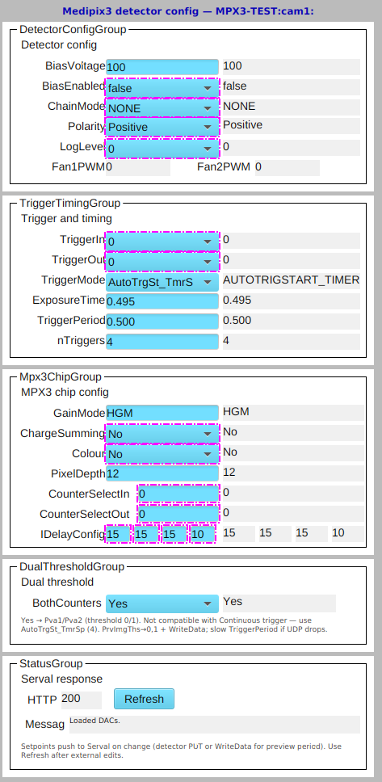
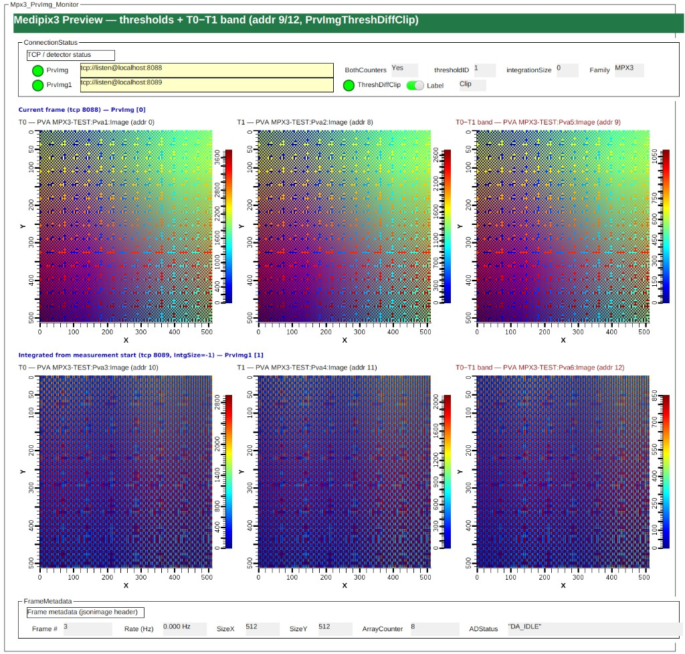

# Medipix3 integration (unified ADServal driver)

**ADServal** is the product name for the unified Serval driver; the EPICS module and repository remain **ADTimePix3** ([NAMING.md](../NAMING.md)).

## Development history

Medipix3 was integrated for release **R1-7-0** (driver **1.7.0**, August 2026):

- Merged to [areaDetector/ADTimePix3](https://github.com/areaDetector/ADTimePix3) via PR #15 from [kgofron/ADTimePix3](https://github.com/kgofron/ADTimePix3) (tag **R1-7-0**).
- Feature work lived on branch **`medipix3-integration`** on kgofron/ADTimePix3 (removed after merge).
- Local developer backup: **`/epics/support2/areaDetector/ADTimePix3_mpx3.bkp`** — not an official release tree; use **areaDetector/ADTimePix3** `master` / **R1-7-0** as reference.
- Planning notes: [ADMediPix3](https://github.com/kgofron/ADMediPix3) (separate repo; scope absorbed into the unified driver).

## Runtime detector family

After `GET /detector`, the driver classifies the connected hardware:

| Signal | Medipix3 (MPX3) | Timepix3 (TPX3) |
|--------|-----------------|-----------------|
| `ChipType` | `MPX3` | `TPX3` |
| `MpxType` | 5 | 6 |
| `ChipboardId` prefix | `51…` | `41…` |

EPICS PVs (prefix `cam1:`):

- `DetectorFamily_RBV` — 0=Unknown, 1=TPX3, 2=MPX3
- `ChipType_RBV` — Serval `Info.ChipType`
- `CapTdc_RBV`, `CapTofHist_RBV`, `CapDualPreview_RBV`, `CapImgThresholds_RBV` — capability flags

## Impact on Timepix3 operation

Medipix3 work is **additive**: one driver binary serves both families. After `GET /detector`, the driver sets `detectorFamily_` and branches MPX3-only logic; it does **not** replace the Timepix3 IOC profile or calibration paths.

**For normal TPX3 use** (`./st.cmd`, TPX3 hardware, default PVs), behaviour should match pre-integration operation. Use **`./st_mpx3.cmd` only with MPX3** — that profile enables dual threshold, integrated preview plugins, and `vendor/mpx3/` calibration by design.

### What stays separate

| Layer | Timepix3 (TPX3) | Medipix3 (MPX3) |
|--------|-----------------|-----------------|
| IOC startup | `st.cmd` → `profiles/tpx3/`, `profiles/tpx3/init/` | `st_mpx3.cmd` → `profiles/mpx3/` |
| Calibration | `vendor/tpx3-*` (via `profiles/tpx3/init/paths.cmd`) | `vendor/mpx3/` |
| Phoebus | `TimePix3.bob`; legacy `op/opi/*.opi` (CSS) | `MediPix3/*.bob` |
| NDArray / PVA | Pva1; driver addrs **0**–**3** (typical) | Pva1–Pva8; addrs **0**, **1**, **8**–**13** |

MPX3-only ND plugins (`imageTh1`, `imageInt1`, band-pass on addr 9/12, etc.) are loaded only in **`st_mpx3.cmd`**, not in the default Timepix3 startup.

### Driver behaviour gated on family

| Feature | TPX3 | MPX3 |
|---------|------|------|
| `applyFamilyDefaults()` (GainMode, `PrvImgThs` 0–7, …) | Skipped | Applied once after connect |
| Serval `PUT /detector/config` | TDC, `TriggerDelay`, `PeriphClk80`, … | `BothCounters`, `GainMode`, `IDelayConfig`, … |
| `BothCounters` + Continuous trigger guard | No effect (`detectorFamily_` check) | Blocks acquire / auto-switches mode |
| `emitPreviewThresholdDiff()` (T0−T1 band) | No effect unless `BothCounters=Yes` | Active when `BothCounters=Yes` |
| Capability PVs | `CapTdc=1`, `CapTofHist=1`, … | TDC/ToF off; `CapImgThresholds=1` |

Code: `detectDetectorFamily()` / `applyFamilyDefaults()` in `tpx3App/src/detector_family.cpp` and `ADTimePix.cpp`; config split in `serval_http.cpp` (`detectorFamily_ != MPX3` vs MPX3 branch).

### Shared code paths (both families)

These run for all detectors but are intended to remain backward compatible for TPX3:

1. **Refactored preview** (`processPreviewJsonimageLine` in `serval_stream.cpp`) — `thresholdID=0` → NDArray addr **0** (unchanged for typical TPX3 preview). Addr **8** is used only when Serval sends `thresholdID=1` (MPX3 dual-counter stream).
2. **Preview TCP lifecycle** — disconnect on `acquireStop`, `syncTcpStreamEndpoints()`, port rotation when the configured port is busy. Improves repeat acquire for both families.
3. **`prvImg1Worker`** — starts only when `WritePrvImg1` has a TCP path. Standard TPX3 profile usually leaves `WritePrvImg1=0`.
4. **New DB records** in `Server.template` (`BothCounters`, `GainMode`, `PrvImgThreshDiffClip`, …) — loaded on every IOC; inactive unless written.
5. **`NDARRAY_MAX_ADDR = 14`** — larger internal callback table for all families; TPX3 sites that only use addrs 0–3 are unaffected in routing.

### Regression check (recommended before merge)

On a TPX3 or Timepix3 emulator instance, with the **standard** IOC profile:

1. `DetectorFamily_RBV` = TPX3 after connect.
2. Acquire; confirm preview on **Pva1** (addr 0).
3. ToF / histogram paths if used at your site.
4. Stop → start acquire (preview TCP stability).

Do **not** enable MPX3-only PVs (`BothCounters`, integrated `WritePrvImg1` with extra ND plugins) on a TPX3 IOC unless you intentionally test cross-family configuration.

## Medipix3 IOC profile

Use the Medipix startup profile instead of the default Timepix3 IOC:

```bash
cd iocs/tpx3IOC/iocBoot/iocTimePix
../../bin/linux-x86_64/tpx3App st_mpx3.cmd
```

(`st_mpx3.cmd` has a `tpx3App` shebang; you can also run `./st_mpx3.cmd` if executable.) **libcpr** is built into the module (`tpx3Support/cpr` → `lib/linux-x86_64/libcpr.so`); `tpx3App` RUNPATH resolves it — no separate `LD_LIBRARY_PATH` to `cprSrc` is needed.

Profile contents: `profiles/mpx3/unique.cmd`, `profiles/mpx3/init/detector.cmd`, and MPX3 ND/PVA wiring in `st_mpx3.cmd`.

Defaults (from `profiles/mpx3/init/detector.cmd`):

- PV prefix `MPX3-TEST:`
- asyn port `MPX3`
- 512×512 mask size (`MASK_BPC_NELEMENTS=262144`)
- preview on TCP **8088** / **8089** (`PrvImgThs` / `PrvImg1Ths` **0,1**, jsonimage)
- full-rate **Image[]** TCP **8086** configured but **`WriteImg=0`** (opt-in via `profiles/mpx3/init/img.cmd`)
- **`BothCounters=Yes`**, **`TriggerMode=AUTOTRIGSTART_TIMERSTOP`** (index **4**), **4 triggers**, **0.5 s** period (Erik Accos recipe)
- `PrvImg1` (integrated preview on 8089) — **`prvImg1WorkerThread`**, NDArray addr **10**/**11**, PVA **Pva3**/**Pva4**
- BPC/DACS: `$(ADTIMEPIX)/vendor/mpx3/eq-01.bpc` and `eq-01.dacs` (uploaded in `profiles/mpx3/init/hw.cmd`)

**Phoebus:** main screen is **`tpx3App/op/bob/MediPix3/MediPix3.bob`** (subdirectory `MediPix3/`, not `op/bob/MediPix3.bob`). Defaults **`P=MPX3-TEST:`**, **`R=cam1:`**. Related: destination writer **`Acquire/Mpx3ServerFileWriter.bob`** embeds **Preview** (`Mpx3PreviewChannels.bob`, 8088/8089) and **Image[]** (`Mpx3ImageChannels.bob`: Img[0] 8086 + Img[1] file/8087 + HDF status strip); **`Acquire/Mpx3HdfImgConfig.bob`** (HDFImgT0/T1 path/Capture); **`Acquire/Mpx3ImgMonitor.bob`** (Pva7/Pva8 — low rate only); live preview images in `Acquire/Mpx3PrvImgMonitor.bob`; detector config in `Detector/Mpx3DetectorConfig.bob`. **`Detector/TimePixDetectorHealth.bob`** and **`TimePixDetectorVoltages.bob`** (under `op/bob/Detector`) cross-link for health readbacks. For `PrvImgThs` / `ImgThs` / `Img1Ths` (CHAR waveform), use the Phoebus text field or IOC `dbpf` — plain `caput` with a quoted string clears the array.

Screenshots ([screenshots/](screenshots/)):



*Figure: `Mpx3ServerFileWriter.bob` — family status, PrvImg/PrvImg1 and Img[] paths, WriteData push to Serval.*



*Figure: `Mpx3DetectorConfig.bob` — MPX3 chip, trigger, and layout PVs pushed to Serval on change. **`GainMode`** Serval enum: `SHGM`, `HGM`, `LGM`, `SLGM` (`mbbo` 0–3). **`DetOrient`** rotates preview and Image[] via Serval layout API.*

**BothCounters — two profiles:** Erik (Aug 2026) recommends **`BothCounters=Off`** for default beamline use; if enabled, use **th1 high (~250)**. The **`profiles/mpx3/init/hw.cmd`** / Accos recipe (**`BothCounters=Yes`**, th0+th1 low, IXS band-pass) is an **opt-in** profile for emulator and dual-threshold science — not Erik’s default recommendation.

**Image / profile Y-origin:** NDArray and `NDStats` profiles use **top-left, Y down** (see [COORDINATE_MAP.md](../COORDINATE_MAP.md)). Row/column profiles for the MPX3 IOC are loaded via **`$(ADCORE)/iocBoot/stats_profiles.cmd`** (`NDStatsProfiles.template`) after `commonPlugins.cmd`; `profiles/mpx3/init/hw.cmd` processes `StatsProfInit_` after `iocInit`. Facility ADet image+profile `.bob` screens (`/epics/GUI/SNS/bob`) are adjusted so plot axes match that convention (`$(P)$(R)Cal:…`).

## Emulator workflow

See **[Operator reference § Fresh-start checklist](#fresh-start-checklist)** for the full validated sequence. Short form:

1. Start Serval with a Medipix3 emulator profile (see ADMediPix3 `configs/serval/`).
2. Build this module: `make -j` from the module root.
3. Start IOC: `../../bin/linux-x86_64/tpx3App st_mpx3.cmd` from `iocBoot/iocTimePix`.
4. Confirm `MPX3-TEST:cam1:DetectorFamily_RBV` = `MPX3` after connect.
5. Confirm startup pushed config: `BothCounters_RBV`, `TriggerMode`, `WriteData` (or `dbpf` `WriteData=1` if Serval was late).
6. Start acquisition: `caput MPX3-TEST:cam1:Acquire 1`

## Calibration files (`vendor/mpx3/`)

Default MPX3 BPC/DACS ship under `vendor/mpx3/` (not `vendor/tpx3-demo.*`):

| File | Role |
|------|------|
| `eq-01.bpc` | Pixel config (524288 bytes for 8-chip layout) |
| `eq-01.dacs` | Threshold[0..7] and chip DACs per Medipix3 format |

IOC paths (via `profiles/mpx3/init/paths.cmd`):

- `BPCFilePath` = `$(ADTIMEPIX)/vendor/mpx3/`
- `DACSFilePath` = `$(ADTIMEPIX)/vendor/mpx3/`

Upload on startup via `WriteBPCFile=1` and `WriteDACSFile=1` in `profiles/mpx3/init/hw.cmd`. SERVAL must resolve these paths on **its** host. For a different calibration set, change `BPCFileName` / `DACSFileName` or point paths at a site-specific directory.

## ASI hardware checkout (Erik, June 2026)

Erik’s guidance for **first physical Medipix3 bring-up** and **equalization** (email, June 2026). This is **not** the same profile as the emulator / Accos **dual-counter** recipe in `profiles/mpx3/init/hw.cmd` — use one or the other depending on the test goal.

| Goal | IOC script | Key settings |
|------|------------|--------------|
| Equalization / first hardware checkout | `profiles/mpx3/init/hw_equalize.cmd` | Single threshold, 12-bit, 20 frames, super-low gain |
| Dual-counter live view / IXS band-pass (emulator or post-cal) | `profiles/mpx3/init/hw.cmd` | `BothCounters=1`, thresholds 0+1, 4 triggers @ 0.5 s |

### Erik’s equalization checklist

| Item | Erik’s recommendation | EPICS / notes |
|------|----------------------|---------------|
| Thresholds | **One** threshold, **12-bit** depth | `BothCounters=0`, `PixelDepth=12`, `PrvImgThs` / `PrvImg1Ths` = `0` |
| Timing | **495 ms** shutter high, **5 ms** shutter down | `AcquireTime=0.495`, `AcquirePeriod≥0.5` (period must cover exposure + shutter down) |
| Frames | **20** frames | `NumImages=20`, `ImageMode=1` (Multiple) |
| Gain | **Super-low gain** (`SLGM`) | Erik Aug 2026: **`SLGM`** for uncalibrated frame / equalization tests; **`HGM`** after cal (~10 keV). Enum: `SHGM`, `HGM`, `LGM`, `SLGM`. |
| Threshold level | DAC **~50–90** so noise pixels are visible | Set via **Accos equalization** or chip DAC / `.dacs` — not automated in the IOC script |
| Bias / sensor | **100 V**, Si **300 µm**, **positive** polarity | `BiasVolt=100`, `Polarity=0` (Positive); see detector delivery sheet if different |
| Calibration | **Equalization with Accos** | Run Accos first; then upload resulting BPC/DACS via `WriteBPCFile` / `WriteDACSFile` |
| ChargeSumming / Colour | **Off by default** | `ChargeSumming=0`, `Colour=0`. Erik Aug 2026: ChargeSumming uses th0 (arbitrated) + th1 (charge-summed, separate cal); Colour = spectral mode (4 or 8 images), needs special sensor. |
| Integrated preview | **`IntegrationMode: last`**, not sum | Already IOC default: `PrvImg1IntgMode=2` on 8089 |

### Live view vs full-rate saving (Erik)

| Use case | Serval path | MPX3 IOC default |
|----------|-------------|------------------|
| Beamline live view | Preview (frame + integrated) + count histogram | `WritePrvImg=1` (8088), `WritePrvImg1=1` (8089) |
| Data saving at full rate | `Image[]` | TCP **8086**, `WriteImg=0` until needed — `< profiles/mpx3/init/img.cmd` |

Medipix3 has **no Timepix3-style raw `.tpx3` stream** and sends **full image arrays** (no zero-suppression / pixel-hit stream). Highest practical rates (fast PC + SSD): **~2000 Hz** (12-bit continuous); **~750 Hz** (24-bit or dual 12-bit counter). Sequential shutter down: **~5 ms** safe, **~2 ms** minimum; **0.5 ms** (12-bit) / **1.3 ms** (24-bit) in other modes.

## Family TCP port map (TPX3 / MPX3 / TPX4)

Convention: port = **8084 + slot**. Documented for the unified driver; MPX3 Phase A adopts Image **8086** now. TPX3 Raw primary remains **8085** in legacy `profiles/tpx3/init/paths.cmd` until a dedicated migration (target Raw[0]=**8084**).

| Port | Slot | Role | MPX3 default | TPX3 today | TPX4 (future) |
|-----:|------|------|--------------|------------|---------------|
| 8080 | — | Serval HTTP | — | — | ASI examples |
| 8081 | — | Serval HTTP | yes | yes | alternate |
| 8084 | Raw[0] | Raw TCP primary | unused (file) | migrate target | yes |
| 8085 | Raw[1] | Raw TCP secondary | unused | legacy Raw[0] / Raw1 | yes |
| **8086** | **Image[0]** | Full-rate Image TCP | **paths ready, WriteImg=0** | legacy often 8087 | yes |
| 8087 | Image[1] | Second Image[] (file or TCP companion) | **paths + UI** (`WriteImg1=0`); file-first; TCP needs reader (`img1Worker` deferred) | optional Img1 | optional |
| **8088** | Preview[0] | Preview frame | **On** | optional | yes |
| **8089** | Preview[1] | Preview integrated | **On** | often PrvImg | yes |
| 8451 | — | Preview histogram | off | yes | TBD |

### Serval API reference (OpenAPI)

**Source of truth:** the OpenAPI spec served by **your running Serval jar** (version-specific). Use it for enums, constraints, and MPX3-only fields (`BothCounters`, `GainMode`, `PixelDepth`, …). The ASI TPX3 PDF manual (§4) is useful background but predates many MPX3 config keys.

| Resource | URL (replace `<port>` with `SERVER_URL`, e.g. **8081** in `st_mpx3.cmd`) |
|----------|---------------------------------------------------------------------------|
| Swagger UI | `http://localhost:<port>/docs/` |
| OpenAPI JSON | `http://localhost:<port>/openapi.json` |
| OpenAPI YAML | `http://localhost:<port>/openapi.yaml` (browser “Save as…” works) |

The Swagger **Servers** dropdown may still show `8080`; use the browser URL port that matches your running instance.

**Query from the shell** (Serval must be up):

```bash
PORT=8081   # match SERVER_URL / st_mpx3.cmd

# Full spec (pretty-printed)
curl -s "http://localhost:${PORT}/openapi.json" | python3 -m json.tool > serval-openapi-4.1.6-experimental-build1760.json

# One schema field (example: PixelDepth on MPX3)
curl -s "http://localhost:${PORT}/openapi.json" | python3 -c "
import json, sys
s = json.load(sys.stdin)['components']['schemas']
print(json.dumps(s['Mpx3DetectorConfig']['properties']['PixelDepth'], indent=2))
"

# Live detector / destination (what Serval has now)
curl -s "http://localhost:${PORT}/detector/config" | python3 -m json.tool
curl -s "http://localhost:${PORT}/server/destination" | python3 -m json.tool
curl -s "http://localhost:${PORT}/dashboard" | python3 -m json.tool
```

In Swagger UI, browse **Schemas → `Mpx3DetectorConfig`**, **`GainMode`**, **`DestinationConfig`**, **`PreviewSpec`**, **`Format`**, **`Mode`**.

**Local snapshots (not committed):** `documentation/medipix3/drafts/` is **gitignored** — appropriate for saved OpenAPI exports, email drafts, and one-off Serval JSON dumps. Prefer a **versioned filename** tied to the jar, not bare `openapi.yaml`, e.g. `serval-openapi-4.1.6-experimental-build1760.yaml` / `.json` (`info.version` from the spec + `SoftwareBuild` from `/dashboard`). Re-fetch from `/openapi.json` when Serval is upgraded; the live endpoint always beats a stale copy. Do **not** commit full OpenAPI files to the main repo (large, version-coupled, redundant with the running server).

**IOC vs Serval:** **`PixelDepth`** mbbo matches OpenAPI (**1 / 6 / 12 / 24** via ZRVL…THVL). Default **12-bit** (`VAL=2`). Fresh emulator may read **`PixelDepth: 1`** until `profiles/mpx3/init/hw.cmd` runs (`dbpf … PixelDepth 2` = mbbo index for 12-bit). Use mbbo **index** or **`caput … 12`** (ONVL/TWVL value), not `"12"` as enum index. **`TriggerMode`** mbbo index **0–8** matches OpenAPI (including **`FOLLOWING`** at index **8**). **`PipelineState_RBV`** mbbi mirrors **`Measurement.Info.Status`**.

**Dual threshold (BothCounters):** T0 and T1 share **one** TCP socket (e.g. Preview 8088 or Image 8086), demuxed by jsonimage **`thresholdID`**. Ports 8086/8087 are Image channel 0 vs 1 (frame vs optional companion), **not** T0 vs T1. Image[1] defaults to **`file:/media/nvme/img1`** with `IntgSize=-1` / `last` (Preview-8089-like role on Serval); switch path to `tcp://listen@localhost:8087` and `Img1FileFmt=jsonimage` only when a TCP consumer exists.

**Fetch script:** [`scripts/fetch-serval-openapi.sh`](scripts/fetch-serval-openapi.sh) saves a versioned OpenAPI snapshot under `drafts/` (same naming convention as above).

## Operator reference (MPX3)

Quick lookup for beamline operators and IOC maintainers. Default PV prefix **`MPX3-TEST:cam1:`** (from `st_mpx3.cmd`).

### Fresh-start checklist

Validated on Serval **4.1.6-EXPERIMENTAL** (build **1760**) with the MPX3 emulator:

1. **Start Serval** on the HTTP port in `SERVER_URL` (default **8081**).
2. **Build / install** after driver or DB changes: `make -C iocs/tpx3IOC install`.
3. **Start IOC:** `cd iocs/tpx3IOC/iocBoot/iocTimePix && ./st_mpx3.cmd` (or `../../bin/linux-x86_64/tpx3App st_mpx3.cmd`).
4. **Connect:** IOC console shows `Detector CONNECTED` and dashboard `http_code = 200`; `DetectorFamily_RBV` = **MPX3**.
5. **Init scripts** (included from `st_mpx3.cmd`): `profiles/mpx3/init/paths.cmd` then `profiles/mpx3/init/hw.cmd` — pushes BPC/DACS, **`PixelDepth=12-bit`** (mbbo index **2**), **`TriggerMode=AUTOTRIGSTART_TIMERSTOP`** (index **4**), **`BothCounters=Yes`**, destination + **`WriteData=1`**.
6. **Acquire:** `caput MPX3-TEST:cam1:Acquire 1` (or Phoebus). Expect `ADStatus=1`, Serval log **`Processed N frames and dropped 0 frames`**, `PipelineState_RBV` → **DA_RECORDING** then **DA_IDLE**.
7. **Preview:** `PrvImg` / `PrvImg1` TCP workers connect to **8088** / **8089** when measurement starts; **`PrvImg TCP connection closed by peer`** at stop is normal.

**Fresh emulator quirk:** Serval may report **`PixelDepth: 1`** before init — the IOC mbbo only labels 1/6/12/24; init **`dbpf … PixelDepth 2`** sets 12-bit. Do not use **`dbpf … PixelDepth 12`** (that is the mbbo *value* field for 12-bit, not the index — use index **2** or **`caput … 12`**).

**If acquire returns 0 frames:** check Serval measurement log, `TriggerMode` vs `BothCounters`, preview TCP ports, and that **`WriteData=1`** pushed destination (see [IOC startup warnings](#ioc-startup-warnings)).

### PV → Serval mapping (detector + measurement)

| EPICS PV (`cam1:`) | Serval path / API | Notes |
|--------------------|-------------------|--------|
| `GainMode` / `_RBV` | `PUT/GET /detector/config` → `GainMode` | mbbo: `SHGM`, `HGM`, `LGM`, `SLGM` (0–3) |
| `PixelDepth` / `_RBV` | `Config.PixelDepth` | mbbo values **1, 6, 12, 24**; default **12** |
| `BothCounters` / `_RBV` | `Config.BothCounters` | MPX3 only; sets dual-counter destination |
| `TriggerMode` / `_RBV` | `Config.TriggerMode` | mbbo index **0–8** → Serval enum string (see below) |
| `DetOrient` / `_RBV` | `Layout.DetectorOrientation` | mbbo index **0–7**; driver `readEnum()`; `rotateLayout()` on write |
| `AcquireTime` | `Config.ExposureTime` | Shutter high time [s] |
| `AcquirePeriod` | `Config.TriggerPeriod` | Trigger period [s] |
| `NumImages` | `Config.NumberOfFrames` | Finite acquisition frame count |
| `ImageMode` | `Config.AcquisitionMode` | Single / Multiple / Continuous |
| `BiasVolt` | `Config.BiasVoltage` | Sensor bias [V] |
| `PrvPeriod` | `Destination.Preview.Period` | Preview throttle [s]; pushed on `WriteData` |
| `PrvImgThs`, `PrvImg1Ths`, `ImgThs` | `…Thresholds[]` | Comma-separated counter indices (e.g. `0,1`) |
| `WriteData` | `PUT /server/destination` + config | Push destination + detector config to Serval |
| `WriteBPCFile`, `WriteDACSFile` | File upload endpoints | Paths on **Serval host** |
| `Acquire` | `GET /measurement/start`, `/stop` | areaDetector acquire |
| `FrameCount_RBV` | `GET /measurement` → `Info.FrameCount` | Serval frame count |
| `DroppedFrames_RBV` | `Info.DroppedFrames` | |
| `Status_RBV` | `Info.Status` or dashboard `Measurement.Status` | Raw PipelineState string (e.g. `DA_IDLE`) |
| `PipelineState_RBV` | same | mbbi via driver **`readEnum()`**: **0**=starting, **1**=recording, **2**=stopping, **3**=idle, **-1**=unknown |
| `ElapsedTime_RBV`, `TimeLeft_RBV` | `Info.ElapsedTime`, `TimeLeft` | During measurement |

Chip-level PVs (`ChargeSumming`, `Colour`, `CounterSelectIn`, `IDelayConfig`, …) map to per-chip config on `Mpx3DetectorConfig.bob`; see OpenAPI **`Mpx3ChipConfig`** / chip endpoints.

### TriggerMode (mbbo index 0–8)

Enum choices come from the driver **`readEnum()`** table (`ADTimePix.cpp`); DB records leave enum fields empty (`TimePix3Base.template`). Phoebus menus show **Serval `TriggerMode` strings** for indices 0–6 and 8; index **7** uses menu label **`SwReSt_SwReSp`** because `SOFTWARESTART_SOFTWARESTOP` exceeds the EPICS enum string limit (25 chars). Serval always receives the full string; use **`TriggerModeC_RBV`** for the raw Serval readback.

| Index | Phoebus menu (readEnum) | Serval enum | MPX3 notes |
|------:|-------------------------|-------------|------------|
| 0 | `PEXSTART_NEXSTOP` | `PEXSTART_NEXSTOP` | External start, next stop |
| 1 | `NEXSTART_PEXSTOP` | `NEXSTART_PEXSTOP` | Next start, previous stop |
| 2 | `PEXSTART_TIMERSTOP` | `PEXSTART_TIMERSTOP` | External start, timer stop |
| 3 | `NEXSTART_TIMERSTOP` | `NEXSTART_TIMERSTOP` | Next start, timer stop |
| 4 | `AUTOTRIGSTART_TIMERSTOP` | `AUTOTRIGSTART_TIMERSTOP` | **Default in `profiles/mpx3/init/hw.cmd`**; Accos dual-counter recipe |
| 5 | `CONTINUOUS` | `CONTINUOUS` | **Incompatible with `BothCounters=Yes`** (driver blocks or auto-switches to 4) |
| 6 | `SOFTWARESTART_TIMERSTOP` | `SOFTWARESTART_TIMERSTOP` | Software start, timer stop |
| 7 | `SwReSt_SwReSp` | `SOFTWARESTART_SOFTWARESTOP` | Menu shortened; Serval string unchanged |
| 8 | `FOLLOWING` | `FOLLOWING` | OpenAPI **follower** mode; use when external master trigger drives acquisition (verify on target Serval / hardware) |

Write via **`TriggerMode`** mbbo or **`caput … TriggerMode 4`**. Driver clamps out-of-range indices to **0**. Phoebus combo boxes may **truncate long menu strings** (widget width); the RBV and tooltip show the full `readEnum()` label (e.g. `AUTOTRIGSTART_TIMERSTOP`).

### DetOrient (layout orientation, index 0–7)

Enum choices come from the driver **`readEnum()`** table (`ADTimePix.cpp` `kDetOrientationNames[]`); DB records leave enum fields empty (`ADTimePix3.template`). Menu labels match Serval **`Layout.DetectorOrientation`** strings.

| Index | Phoebus menu / Serval string |
|------:|------------------------------|
| 0 | `UP` |
| 1 | `RIGHT` |
| 2 | `DOWN` |
| 3 | `LEFT` |
| 4 | `UP_MIRRORED` |
| 5 | `RIGHT_MIRRORED` |
| 6 | `DOWN_MIRRORED` |
| 7 | `LEFT_MIRRORED` |

Writing **`DetOrient`** calls **`rotateLayout()`** (`GET /detector/layout/rotate?reset=true` with direction/flip query params). Rotation applies to **preview** and **Image[]** streams on both TPX3 and MPX3. **`DetOrient_RBV`** is refreshed from Serval on connect (`GET /detector`).

**MPX3 caveat:** mask/BPC edit, **`RefreshPixelConfig`**, and Phoebus mask overlay still use the TPX3 chip stride (65536 B per chip). Layout rotation does **not** yet remap mask pixels for MPX3 until the **`mask_io`** 131072-byte-per-chip fix — see [Open work — Mask / BPC](#mask--bpc--mpx3-dual-threshold-layout-identified-driver-compare-still-wrong). The hint on **`Mpx3DetectorConfig.bob`** (Layout group) documents this.

### Measurement pipeline state

Serval **`Measurement.Info.Status`** (`PipelineState` in OpenAPI). **`GET /dashboard`** uses a flat **`Measurement.Status`** (no `Info` wrapper). Enum labels from driver **`readEnum()`** (`Measurement.template` has no DB enum fields; index **-1** = Unknown at IOC start before sync). Raw string on **`Status_RBV`**.

Dashboard polls and **`RefreshConnection`** update PipelineState when **`Measurement.Status`** is present; a null or status-less dashboard snapshot does **not** clear a prior **DA_IDLE** after stop.

| `PipelineState_RBV` | `Status_RBV` string | Meaning |
|--------------------:|---------------------|---------|
| 0 | `DA_STARTING` | Measurement starting |
| 1 | `DA_RECORDING` | Active acquisition |
| 2 | `DA_STOPPING` | Stop in progress |
| 3 | `DA_IDLE` | Idle (no measurement) |
| -1 | *(empty or unknown)* | No measurement / null status |

During **`Acquire`**, poll **`PipelineState_RBV`** or **`FrameCount_RBV`**. Legacy alias **`DA_STOPPED`** is treated as idle (index 3) in the driver.

### Configuration incompatibilities

| Condition | Conflict | Driver / Serval behaviour |
|-----------|----------|---------------------------|
| `BothCounters=Yes` | `TriggerMode=CONTINUOUS` (index **5**) | Serval rejects; driver **auto-switches to 4** when BothCounters written, or **blocks acquire** |
| `BothCounters=Yes` | `PixelDepth=24` | Driver **blocks** config / acquire (`24-bit` incompatible with dual counter) |
| `BothCounters=Yes` | Short `AcquirePeriod` | UDP packet drops, horizontal banding in image — use **≥ 0.5 s** for dual-counter emulator tests |
| Fresh Serval | `PixelDepth=1` before init | Run **`profiles/mpx3/init/hw.cmd`** or `dbpf PixelDepth 2` for 12-bit |
| `WritePrvImg1=1` | No IOC reader on **8089** | Serval **`Preview buffer full`** — keep integrated preview enabled only when IOC connects |
| High-rate `Image[]` | PVA on Pva7/Pva8 | Disable PVA callbacks; use **HDFImgT0/T1** for archive |

See also [BothCounters operational notes](#bothcounters-operational-notes-2026-06) and [Erik’s dual-threshold recipe](#eriks-validated-dual-threshold-recipe-accos-2026-06-12).

## Full-rate Image mode (Phase A)

Preview stays the operator path (`PrvPeriod` throttle). `Image[]` is a separate Serval destination for every frame (no Period). Keep them on **different ports**.

### Destination shape (when WriteImg=1)

```json
{
  "Image": [{
    "Base": "tcp://listen@localhost:8086",
    "FilePattern": "f%MdHms_",
    "Format": "jsonimage",
    "Mode": "count",
    "Thresholds": [0, 1],
    "IntegrationSize": 1,
    "StopMeasurementOnDiskLimit": false,
    "QueueSize": 1024
  }],
  "Preview": {
    "Period": 0.5,
    "SamplingMode": "skipOnFrame",
    "ImageChannels": [
      { "Base": "tcp://listen@localhost:8088", "Format": "jsonimage", "Mode": "count",
        "Thresholds": [0, 1], "IntegrationSize": 1, "QueueSize": 16 },
      { "Base": "tcp://listen@localhost:8089", "Format": "jsonimage", "Mode": "count",
        "Thresholds": [0, 1], "IntegrationSize": -1, "IntegrationMode": "last", "QueueSize": 16 }
    ]
  }
}
```

Serval requires the same **Mode** on all output channels (manual limitation).

### Enable / disable

Paths are set in `profiles/mpx3/init/paths.cmd` with `WriteImg=0`. To turn full-rate Image on:

```bash
# iocsh:
< profiles/mpx3/init/img.cmd
# then acquire — imgWorker connects when WriteImg=1, tcp path, ImgAccumulationEnable=1
```

Disable: `dbpf WriteImg 0` then `WriteData 1`. Do **not** point Phoebus PVA at full-rate Image for 750–2000 Hz — use HDF5 plugins (`HDFImgT0` / `HDFImgT1`) or accumulation.

![Image[] monitor — Pva7/Pva8 on TCP 8086 (low rate only)](screenshots/Mpx3_img_monitor.png)

*Figure: `Mpx3ImgMonitor.bob` — full-rate Image demux by `thresholdID` to NDArray addr **1** (T0, Pva7) and **13** (T1, Pva8). Disable PVA callbacks at high Hz; use HDFImgT0/T1 for archive.*

### Phase C — HDF5 / rate soak

Plugins in `st_mpx3.cmd` (fixed address at configure):

| Plugin | NDArray addr | Threshold | PV prefix |
|--------|-------------:|-----------|-----------|
| `FileHDFImgT0` | **1** | T0 | `HDFImgT0:` |
| `FileHDFImgT1` | **13** | T1 | `HDFImgT1:` |

```bash
# Host shell once:
mkdir -p /tmp/mpx3_hdf

# iocsh (restart IOC after rebuild so HDF plugins load):
< profiles/mpx3/init/img.cmd
< profiles/mpx3/init/hdf5_img.cmd
dbpf("$(PREFIX)cam1:Acquire","1")              # latch dimensions (Capture not armed yet)
# wait until DA_IDLE / ImgFrameNumber advances, then:
< profiles/mpx3/init/hdf5_img_arm.cmd          # Capture=1 (needs ≥1 array first)
dbpf("$(PREFIX)cam1:Acquire","1")              # Stream writes up to NumCapture
```

If you arm Capture before any Image NDArray, NDFile logs:  
`ERROR, must collect an array to get dimensions first` — acquire once, then arm.

If HDF5 logs `H5Fcreate(): invalid file name` / empty path after colon: **`FileTemplate` was empty** (common after autosave). Re-run `profiles/mpx3/init/hdf5_img.cmd` (sets `%s%s_%3.3d.h5` and path with trailing `/`), confirm:

```bash
caget -S MPX3-TEST:HDFImgT0:FileTemplate_RBV MPX3-TEST:HDFImgT0:FilePath_RBV
# expect: %s%s_%3.3d.h5   and   /tmp/mpx3_hdf/
```

Check during/after acquire:

```bash
caget MPX3-TEST:cam1:ImgAcqRate_RBV MPX3-TEST:cam1:ImgFrameNumber_RBV
caget MPX3-TEST:HDFImgT0:Capture_RBV MPX3-TEST:HDFImgT0:NumCaptured_RBV
caget MPX3-TEST:HDFImgT1:NumCaptured_RBV
ls $(MPX3_HDF_PATH=/tmp/mpx3_hdf)
```

**Soak ladder:** start with current Accos timing (0.5 s, 4 frames) → raise `NumImages` / shorten `AcquirePeriod` on emulator → hardware toward ~750 Hz (24-bit / dual) or ~2000 Hz (12-bit). Raise `FileHDFImgT*: queue` in `st_mpx3.cmd` if dropped frames. Keep **Pva7/Pva8** disabled at high rate (`profiles/mpx3/init/hdf5_img.cmd` does this).

**Deferred:** Image[1] **`img1Worker`** (IOC TCP consumer for 8087). Config/UI for Image[1] is available (file or TCP path, `WriteImg1`); Serval file writes work without a worker. Do not enable TCP 8087 without a reader.

### Image mode phase status

| Phase | Work |
|-------|------|
| **A** | ~~IOC TCP Image destination + docs~~ **done** (8086, opt-in `WriteImg`) |
| **B** | ~~Img `thresholdID` demux~~ **done** — T0→addr **1** (Pva7), T1→addr **13** (Pva8); `ImgThresholdID_RBV`; accumulate T0 only |
| **C** | ~~HDF5 plugins + soak recipe~~ **done** (scaffolding); run soak on emulator/hardware as rates allow |

**Verify Phase B after rebuild/restart:** enable Image (`< profiles/mpx3/init/img.cmd`), acquire, then:

```bash
caget MPX3-TEST:cam1:ImgThresholdID_RBV MPX3-TEST:cam1:ImgFrameNumber_RBV
# During BothCounters acquire, ImgThresholdID_RBV should alternate 1 then 0 per trigger.
# Low-rate check: pva://MPX3-TEST:Pva7:Image (T0) and Pva8:Image (T1). Disable PVA at high Hz.
```

### Optional equalization startup

Paths still come from `profiles/mpx3/init/paths.cmd`. For first hardware checkout, **replace** the hardware push in `profiles/mpx3/init/detector.cmd` temporarily:

```bash
# iocsh after iocInit, or edit profiles/mpx3/init/detector.cmd for one session:
< profiles/mpx3/init/paths.cmd
< profiles/mpx3/init/hw_equalize.cmd
```

After equalization, restore the dual-counter profile:

```bash
< profiles/mpx3/init/hw.cmd
```

### Known follow-ups on hardware

- **First-frame artefacts:** physical Timepix3 can show a corrupt first frame after calibration load; emulator may show a brief Signed diff flicker on Pva6 — treat both as hardware/emulator follow-ups.

### Erik Aug 2026 (Email 1 reply) — config summary

| Topic | Erik (ASI) | EPICS impact |
|-------|------------|--------------|
| **`GainMode`** | **`SHGM`, `HGM`, `LGM`, `SLGM`** (super-high → super-low). **`HGM`** calibrated ~10 keV; **`SLGM`** uncalibrated frame tests / equalization. | `profiles/mpx3/init/hw_equalize.cmd` uses **`SLGM`** (3); dual-counter profile uses **`HGM`** (1). **`GainMode`** mbbo PV (0–3). |
| **Equalization** | June checklist **still correct**. | `profiles/mpx3/init/hw_equalize.cmd` unchanged except `SLGM`. |
| **`ChargeSumming`** | Default **off**. When on: th0 = arbitrated image, th1 = charge-summed (separate calibration). | Keep `ChargeSumming=0` in default profiles. |
| **`Colour`** | Default **off** (spectral). 4 images (8 with BothCounters); thresholds 0,2,4,6 (+ odd with BothCounters); special sensor. | Keep `Colour=0` unless ASI enables spectral hardware. |
| **`BothCounters`** | **Not recommended by default.** If used: set to 1 with **th1 high (~250)**. | **`profiles/mpx3/init/hw.cmd`** (Accos / IXS dual-threshold) is a **separate opt-in profile**, not Erik’s default. |
| **`IDelayConfig`** | Standard values; manual per-system tuning **no longer required**. | `[15,15,15,10]` in IOC defaults remains fine. |

Erik offered a **quad MPX3 on loan** for synchrotron/experiment testing (follow up separately). BPC/mask layout and destination reference docs — **still open** (Email 2).

## Open work (TODO)

### Mask / BPC — MPX3 dual-threshold layout identified; driver compare still wrong

Preview and dual-threshold paths are validated. **Mask edit / `PixelConfigDiff` are not production-ready on Medipix3** until the driver uses the **131072-byte-per-chip** compare path and threshold-aware mask indexing.

**Resolved (Aug 2026)** — Serval root dump `documentation/medipix3/drafts/serval-mpx3-quad-root-2026-08-14.json` vs `vendor/mpx3/eq-01.bpc`:

- **`PixelConfig`** decodes to **131072 bytes on all four chips** (not 65536).
- On-disk **`eq-01.bpc`** is **524288 B = 4 × 131072** (not 8 × 65536).
- Layout per chip: **`[threshold 0: 64 KiB][threshold 1: 64 KiB]`** — separate config bytes per counter (values often differ between slices).
- Compare at **`offset = chip × 131072`**, length **131072** → **0 byte mismatches** for chips 0–3.
- The earlier **`RefreshPixelConfig`** errors (CHIP0 length 131072 vs 65536; ~56k mismatches on chips 1–3) match the driver using **`chip × 65536`** (`kPixelConfigBytes` in `serval_http.cpp`) — **not** a bad `eq-01.bpc` file.
- **Byte semantics TBD:** ~25% of MPX3 bytes per slice have bit 0 set (values 1/3/5/7, clustered) — likely **equalization encoding**, not ~10 Accos bad pixels/chip. **Do not use `BPCn` / bit-0 export as MPX3 bad-pixel list.** Ask ASI for disable bit map (Email 2).

**Still open:**

- **Family-specific mask I/O:** Timepix3 = **1 byte/pel/chip**; Medipix3 = **2 bytes/pel/chip** (two sequential 64 KiB threshold slices, not interleaved). `mask_io.cpp` / `pelIndex()` / `RefreshPixelConfig` still follow the TPX3 model (first slice only; chip stride 65536). Branch on **`DetectorFamily`** / `bpcThresholdSlices` in `detector_family.h`.
- **Driver fix:** MPX3 chip stride **131072**; threshold index for mask edit and **`PixelConfigDiff`** (tie to preview **`thresholdID`** or a new PV).
- **`|Δ|` heatmap** one-quadrant pattern — may shrink after compare fix; chip-specific **`Layout.Orientation`** in Serval JSON (e.g. chip 0 `RtLBtT`, chips 2–3 `LtRTtB`) may still need MPX3 **`pelIndex`** validation.
- **Email 2:** ask ASI for MPX3 pixel-byte bit map (disable vs trim); confirm 131072 layout when `BothCounters=0`.

**Next steps:**

- Fix **`refreshPixelConfigFromServal()`** for MPX3 (131072 stride).
- After ASI confirms disable byte: threshold-specific mask test on emulator.
- Re-run **`RefreshPixelConfig`** after driver fix; then Accos post-equalization BPC upload on hardware.

**Code / docs:** `tpx3App/src/serval_http.cpp`, `tpx3App/src/mask_io.cpp`, [PIXELCONFIG_BPC_DIFF.md](../PIXELCONFIG_BPC_DIFF.md).

### Other open items

| Item | Notes |
|------|--------|
| Hardware equalization + dual-counter IXS on real MPX3 | Equalization recipe confirmed; run on hardware when quad available |
| HDF5 / Image[] rate soak | Recipe in place; run on emulator then hardware |
| **`img1Worker`** (Image[1] TCP 8087) | Deferred |
| Phoebus screenshots | `Mpx3_main`, `Mpx3_hdf_img_config`, acquire-active variants |
| Sphinx MPX3 figures | `docs/ADTimePix3/Screenshots/MediPix3/` |

## Serval channel model (Preview vs Image)

Serval `GET http://localhost:8081/` shows `Server.Destination`:

| Serval path | IOC consumer | MPX3 default |
|-------------|--------------|--------------|
| `Preview.ImageChannels[0]` (`PrvImg`) | Yes — `prvImgWorker` TCP client, NDArray/PVA | `WritePrvImg=1`, TCP 8088 |
| `Preview.ImageChannels[1]` (`PrvImg1`) | Yes — `prvImg1Worker` TCP client | `WritePrvImg1=1`, TCP 8089 |
| `Image[]` (full-rate) | `imgWorker` when TCP + accumulation | TCP **8086**, `WriteImg=0` (opt-in `profiles/mpx3/init/img.cmd`) |

The reference `serval_mpx3.json` and the **Serval manual** (destination example, §4 / pp. 18–19) configure **two preview TCP streams**: current frame and an image **integrated from the start of the measurement**. The MPX3 IOC profile (`st_mpx3.cmd`) enables **both** channels: `WritePrvImg=1` on TCP **8088** (`prvImgWorker`) and `WritePrvImg1=1` on TCP **8089** (`prvImg1Worker`). Each stream must have an IOC TCP client during acquire — if Serval pushes to 8089 with no reader, Serval logs **`Preview buffer full`** and repeat acquire can fail.

**Serval manual** (`20251202_ASIServer_TPX3_manual_V4.1.3.pdf`, table 4.3, pp. 19–20): `IntegrationSize` **0 or 1** = no integration; **-1** = integrate all preview samples **from measurement start**; **2…32** = integrate over the last *n* images. `IntegrationMode` is **sum**, **average**, or **last**. ASI recommends **`last`** on 8089 (not sum) — Serval sum integration is costly at higher frame rates. IOC default: `PrvImg1IntgMode=2` (**last**).

After a clean IOC start, confirm Serval shows both preview channels and the IOC has them enabled:

```bash
curl -s http://localhost:8081/ | python3 -m json.tool | grep -A6 ImageChannels
caget MPX3-TEST:cam1:WritePrvImg MPX3-TEST:cam1:WritePrvImg1
```

Both should read **1** after `profiles/mpx3/init/paths.cmd` and `WriteData=1`.

**If you disable integrated preview:** set `WritePrvImg1=0`, run `WriteData=1`, and restart acquire so Serval stops binding 8089. Leaving 8089 enabled in Serval destination without an IOC reader will fill the preview queue.

**Autosave:** if `auto_settings.sav` disagrees with the intended profile (e.g. saved with `WritePrvImg1=0` while you need integrated preview), fix the PVs and `WriteData=1`, or delete/rewrite the autosave file once.

## IOC startup warnings

On first boot (before `WriteData=1`), Serval may log many:

`Failed HTTP request GET /server/destination … Destination is not set.`

This is expected: init `dbpf` on `WriteRaw` / `WritePrvImg` / … PVs triggers a readback from Serval before `profiles/mpx3/init/hw.cmd` pushes the destination. Harmless; it stops after `WriteData=1`.

## How Medipix3 preview images differ from Timepix3

**Vendor notes (ASI):** With **`BothCounters`** enabled, Serval sends **two consecutive jsonimage messages per trigger** on TCP **8088** (`thresholdID=1` then `0`); Accos and the EPICS driver demux by **`thresholdID`** in the header. That is separate from the **frame vs integrated-preview** split on two TCP ports (8088 / 8089). See **[preview-dual-threshold.md](preview-dual-threshold.md)** for Erik’s confirmed Accos behaviour and the implementation plan.

| Concept | MPX3 (Medipix3) | TPX3 (Timepix3) |
|---------|-----------------|-----------------|
| Counter / threshold indices | `Thresholds: [0..7]` — eight virtual counters | Often ToT/TDC modes; different `Mode` strings |
| Preview `Mode` | `count` — pixel values are counter hits | Often `tot`, `count`, etc. |
| Dual-layer preview (Serval manual §4, `serval_mpx3.json`) | **Two TCP channels** — frame vs integrated-from-measurement-start | Usually one preview TCP channel |
| Channel 0 (e.g. 8088) | `IntegrationSize: 0` or `1` — **current frame** (no integration) | Frame preview |
| Channel 1 (e.g. 8089) | `IntegrationSize: -1` — **integrated from measurement start**; ASI example uses `IntegrationMode: last` (non-zero overwrite). IOC default: `PrvImg1IntgMode=2` (**last**) | Enabled in `st_mpx3.cmd` (`PrvImg1` / Pva3–Pva4) |

So the “two images” on **two TCP ports** are **current frame vs time-integrated preview**, not “low threshold vs high threshold”. Dual-threshold images (when **`BothCounters`**) arrive as **consecutive jsonimage messages on 8088**, distinguished by **`thresholdID`**.

**EPICS:** preview TCP **8088** routes by **`thresholdID`** to addr **0** / **8** (Pva1 / Pva2) and emits **T0−T1** on addr **9** (Pva5). Integrated preview on **8089** routes to addr **10** / **11** (Pva3 / Pva4) via **`prvImg1Worker`**, with **T0−T1** on addr **12** (Pva6). **`PrvImgThreshDiffClip=Clip`** (default) applies **`max(0, diff)`** for IXS display; **Signed** mode keeps raw signed diff for pairing diagnostics. Full-rate **Image[]** TCP **8086** demuxes the same way to addr **1** / **13** (Pva7 / Pva8); running-sum accumulation uses **threshold 0 only**.



*Figure: `Mpx3PrvImgMonitor.bob` — six PVA image widgets: current frame (Pva1/Pva2/Pva5 on 8088) and integrated-from-measurement-start (Pva3/Pva4/Pva6 on 8089). Band-pass uses driver addr **9** / **12** (not NDPluginProcess).*

### BothCounters operational notes (2026-06)

Serval **rejects** `BothCounters=true` with **`TriggerMode: CONTINUOUS`** (`TriggerMode` PV index **5**). The MPX3 IOC startup profile uses **`TriggerMode=4`** (`AUTOTRIGSTART_TIMERSTOP`) with **`BothCounters=Yes`**. The driver auto-switches **5→4** when **`BothCounters=Yes`** is written later and blocks acquire if both are still active.

Recommended checklist when enabling dual threshold:

1. **DetConfig:** `BothCounters=Yes` (driver sets `PrvImgThs` to `0,1`; run **WriteData** to push destination).
2. **TriggerMode** not **CONTINUOUS** (index **5**); use **4** or **6**.
3. **AcquirePeriod** long enough for dual-counter readout — Erik’s Accos reference uses **0.5 s**; shorter periods may log `Dropping frame … missing UDP packet(s) … (2/4)`.
4. Acquire; check **`PrvImgThresholdID_RBV`**, **Pva1** / **Pva2** on `Mpx3PrvImgMonitor`; band-pass **Pva5** / **Pva6** (addr 9/12) with **`PrvImgThreshDiffClip`** as needed.

UDP `(2/4)` drops and a **horizontal split at y=256** in the image mean half the chip UDP packets did not arrive before Serval assembled the frame — usually trigger rate or hardware/emulator limits, not EPICS preview TCP.

Each jsonimage line on the wire is: JSON header + binary pixel array. The driver parses header fields and demuxes by **`thresholdID`**: frame preview on **8088** → addr 0/8 (band 9); integrated preview on **8089** → addr 10/11 (band 12).

### MPX3 detector fields not in Serval manual §4

| Field | Role | Notes |
|-------|------|-------|
| **`GainMode`** | Pre-amplifier gain on the Medipix3 chip | Serval **`Config.GainMode`** string. Erik Aug 2026 enum: **`SHGM`**, **`HGM`**, **`LGM`**, **`SLGM`** (super-high → super-low, mbbo 0–3). **`HGM`**: calibrated ~10 keV (Accos recipe, `profiles/mpx3/init/hw.cmd`). **`SLGM`**: uncalibrated frame / equalization tests (`profiles/mpx3/init/hw_equalize.cmd`). Driver family default on connect: **`SHGM`** (emulator) / **`HGM`** (MPX3 applyFamilyDefaults). Written via **`GainMode`** mbbo → `PUT /detector/config`. |
| **`Preview period`** | Throttle live preview rate | Serval **`Preview.Period`** (seconds), separate from **`TriggerPeriod`**. Set via **`PrvPeriod`** PV; pushed on **`WriteData`**. Erik’s working UI used **0.5 s** preview period with **0.5 s** trigger period. **`PrvSmplgMode`**: `skipOnFrame` (0) or `skipOnPeriod` (1). |
| **`BiasVoltage`** | Sensor bias | Erik: **100 V**. Low values (e.g. 12) can prevent useful counts on hardware/emulator. |
| **`PixelDepth`** | Counter bit depth | Erik / IXS default: **12**. OpenAPI: **1, 6, 12, 24**; **24** incompatible with **`BothCounters`** and **CONTINUOUS**. IOC mbbo exposes all four; driver passes values through to Serval. Init: `dbpf … PixelDepth 2` (12-bit index), or `caput … 12`. |
| **`IDelayConfig`** | Inter-chip delay tuning | Erik Aug 2026: **`[15, 15, 15, 10]`** are standard; manual per-system tuning no longer required. On **`Mpx3DetectorConfig.bob`**. |

### Erik’s validated dual-threshold recipe (Accos, 2026-06-12)

Erik confirmed **4 triggers → 8 preview frames** on TCP **8088** (`thresholdID=1` then `0` per trigger, full 512×512). Matching EPICS settings:

```bash
caput MPX3-TEST:cam1:BothCounters 1
caput MPX3-TEST:cam1:TriggerMode 4          # AUTOTRIGSTART_TIMERSTOP (index 4)
caput MPX3-TEST:cam1:ImageMode 1            # finite (Multiple)
caput MPX3-TEST:cam1:NumImages 4
caput MPX3-TEST:cam1:AcquirePeriod 0.5
caput MPX3-TEST:cam1:AcquireTime 0.495
caput MPX3-TEST:cam1:PrvImgThs "0,1"
caput MPX3-TEST:cam1:WriteData 1
caput MPX3-TEST:cam1:Acquire 1
```

During acquire, **`PrvImgThresholdID_RBV`** should alternate **1 → 0** as **`PrvImgFrameNumber_RBV`** steps 0…3. **`NumImagesCounter`** / Serval **`FrameCount`** count **triggers** (4), not jsonimage messages (8). Rebuild **`tpx3App`** after driver changes (`make -C iocs/tpx3IOC install`) and restart the IOC before testing.

See **[preview-dual-threshold.md](preview-dual-threshold.md)** for Accos code reference and resolved open questions.

## Preview TCP ports and acquisition

Preview uses `tcp://listen@localhost:PORT` so **Serval binds** the port and the IOC **connects** as a client (`PrvImg` worker thread).

Serval 4.x may **leave preview TCP listeners bound** after `measurement/stop`. If the configured port is still listening, the driver picks the next free port and re-pushes `WriteData`. With **both preview channels** connected and a clean stop, repeat acquire on **8088** / **8089** usually works without rotation.

**Driver behavior:**

- Before connect, `syncTcpStreamEndpoints()` re-reads `PrvImgFilePath` into the cached host/port (fixes “Serval on 8089, IOC still connecting to 8088”).
- Port rotation runs **only when the configured port is already in use**, or on bind-failure retry.
- `acquireStop` disconnects the IOC TCP client before `measurement/stop`.

**MPX3 v1 profile:** `WritePrvImg=1` (TCP 8088) and `WritePrvImg1=1` (TCP 8089 integrated preview). Disable either channel if you do not need it.

**Manual recovery if Serval is wedged:** restart Serval, then restart the IOC and `WriteData=1`.

## v1 scope (out of scope)

Spectral mode, TDC, and Timepix-only ToF histogram paths are flagged off for MPX3 via capability PVs. See ADMediPix3 `docs/implementation-plan.md`.
